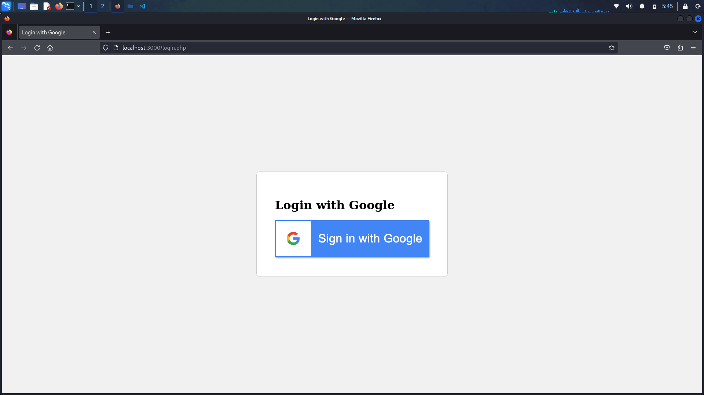
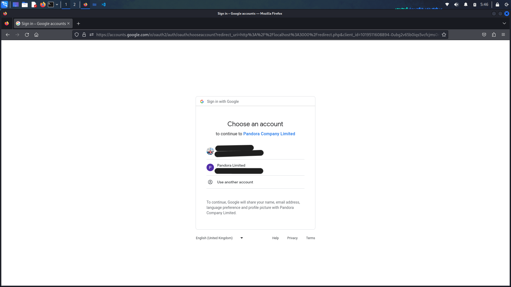

# Pandora Company Limited OAuth2 Integration Project

## Overview



In response to the growing importance of robust and secure user authentication systems in the modern digital business landscape, Pandora Company Limited initiated a strategic project to streamline user authentication processes across their applications. The primary objective was to integrate a centralized user management system with OAuth2, a widely adopted and highly secure authentication protocol, providing users with the convenience of logging in using their Google accounts.

This README provides a comprehensive overview of the implementation, detailing the architecture, components, security considerations, and key achievements of this transformative project. By enhancing user authentication through OAuth2 integration, Pandora Company Limited aims to elevate user experience, strengthen security, and pave the way for further technological advancements in their application ecosystem.




## PHP Environment Setup

To set up the PHP environment for the project, follow these steps:

1. Install PHP and necessary modules:
    ```bash
    sudo apt install php
    ```

2. Install the 'curl' extension for OAuth2 implementation:
    ```bash
    sudo apt install php-curl
    ```

3. Install Composer:
    ```bash
    sudo apt install composer
    ```

4. Initiate the project and create `composer.json`:
    ```bash
    composer init
    ```

5. Install dependencies mentioned in `composer.json`:
    ```bash
    composer install
    ```

6. Create the PHP environment:
    ```bash
    php -S localhost:3000 -t .
    ```

## Project Summary

The project involves the integration of OAuth2 for user authentication in PHP-based applications, focusing on enabling "Login with Google" functionality. Key components include a login page with a "Login with Google" button, a redirect page for handling Google's OAuth2 authentication, and a user dashboard displaying personalized content upon successful login.

### Key Steps:

1. **OAuth2 Implementation:** Configure OAuth2 for seamless integration.
2. **User Dashboard Customization:** Develop a user-friendly dashboard for personalized content.
3. **User Session Management:** Implement secure and efficient user session handling.

### Challenges:

- **OAuth2 Configuration:** Ensure correct configuration for OAuth2 integration.
- **Security Considerations:** Address security challenges associated with authentication.
- **User Session Management:** Implement strategies for managing user sessions.
- **User Experience:** Ensure a smooth and convenient user experience.

### Future Directions:

The project aims to provide Pandora Company Limited with a robust, user-friendly, and secure authentication solution. The ongoing focus includes continuous improvements, addressing potential challenges, and staying aligned with evolving technological trends.
